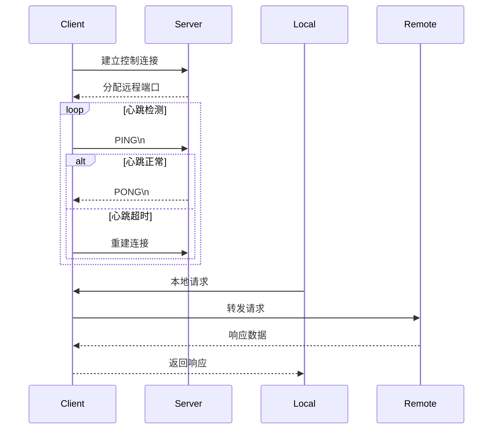

# Doggie Tunnel - 内网穿透隧道工具

[](https://goreportcard.com/report/github.com/digitalrusher/doggie-tunnel)
[](https://opensource.org/licenses/MIT)

专业级TCP隧道内网穿透解决方案，支持自动重连、心跳检测和双向流量转发。

## 功能特性

- ✅ 安全稳定的TCP隧道穿透
- ✅ 智能心跳保活与自动重连机制
- ✅ 可视化端口流量统计
- ✅ 动态端口池管理（服务端）
- ✅ 多平台支持（Windows/Linux/macOS）

## 工作流程
1. 客户端与服务端建立控制连接
2. 服务端分配远程端口并通知客户端
3. 客户端启动本地端口监听
4. 建立双向数据通道：
   - 本地流量 → 客户端 → 服务端 → 远程目标
   - 远程响应 ← 客户端 ← 服务端 ← 远程目标
5. 心跳机制维持控制连接
6. 异常时自动重建连接并恢复转发

## 快速开始

### 编译安装
```bash
go build -o doggie-tunnel
```

### 服务端启动
```bash
./doggie-tunnel server \
  --port=8080 \
  --start=10000 \
  --end=20000
```

### 客户端连接
```bash
./doggie-tunnel client \
  --server=your-server:8080 \
  --local=80 \
  --remote=0
```

## 配置说明
```yaml
server:
  port: 8080       # 控制连接端口
  start: 10000     # 端口池起始
  end: 20000       # 端口池结束
  heartbeat: 15s   # 心跳检测间隔

client:
  server_addr: "your-server:8080"
  local_port: 80     # 本地服务端口
  remote_port: 0     # 自动分配远程端口
  retry_interval: 5s # 重连间隔
  max_retries: 5     # 最大重试次数
  log_level: info    # 日志级别(debug/info/warn/error)
```

## 架构原理


## 开发指南
```bash
# 安装依赖
go mod tidy

# 运行测试
go test -v ./...
```

## 贡献规范
1. Fork仓库并创建特性分支
2. 提交清晰的commit message
3. 通过全部测试用例
4. 发起Pull Request

## License
MIT License